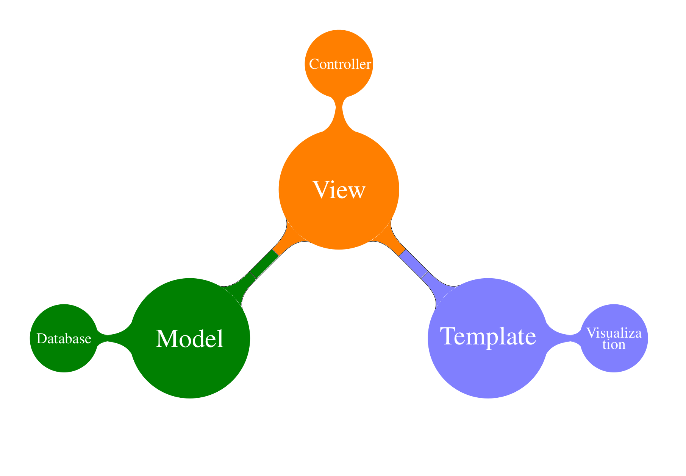
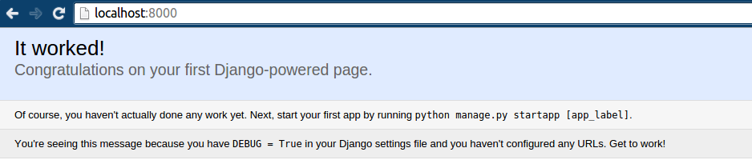
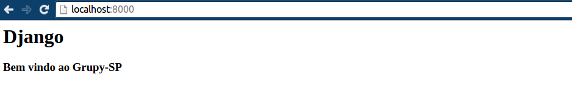
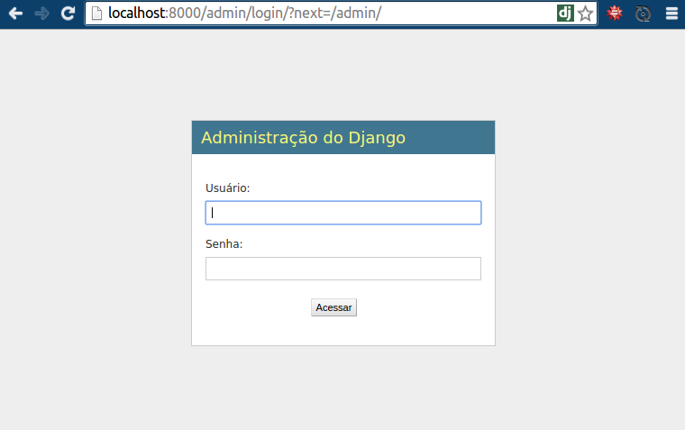
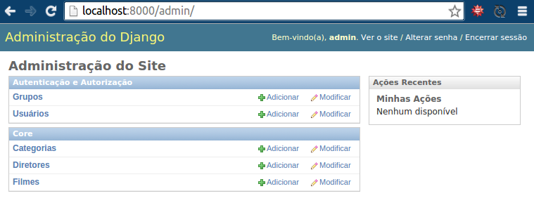
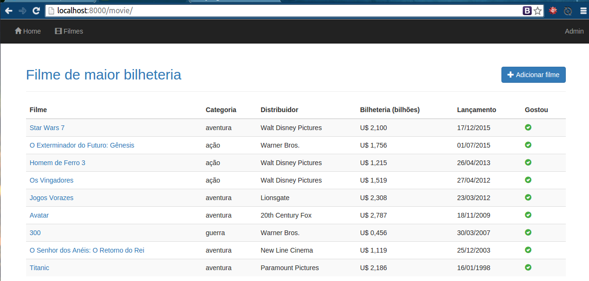
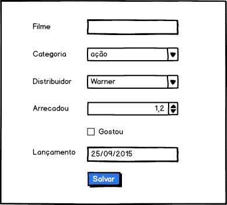
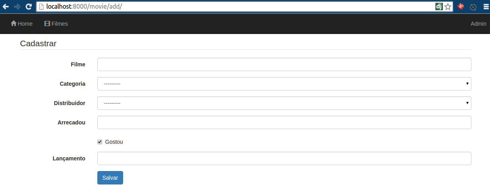
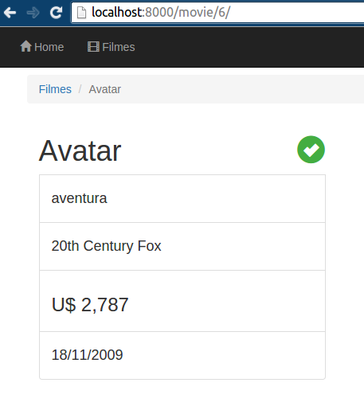

# Django 1.8


## Tutorial de Django para o Grupy-SP realizado dia 25/09/15.

### Se tiver pressa...

	$ git clone https://github.com/rg3915/django1.8.git
	$ virtualenv -p python3 django1.8
	$ cd django1.8
	$ source bin/activate
	$ make initial
	$ ./manage.py runserver

... senão, leia o tutorial.

## Ementa

* [MTV e ORM](#mvc-x-mtv)
* [1 min de Python](#1-min-de-python)
* [Instalação](#o-que-voc%C3%AA-precisa)
* [Criar o ambiente](#criando-o-ambiente)
* [Criar o projeto e a App](#criando-o-projeto-e-a-app)
* [Deploy no Heroku](#deploy-no-heroku)

## Objetivo

Criar uma lista de filmes e retornar o filme de maior bilheteria.

* Criar um formulário
* Criar uma lista de filmes
* Ver os detalhes de cada filme


## O que é Django?

Segundo Django Brasil,

*Django é um framework web de alto nível escrito em Python que estimula o desenvolvimento rápido e limpo.*

* adota o padrão MTV
* possui ORM
* admin
* herança de templates e modelos
* open source


## Quem usa Django?


https://www.djangosites.org/


## Sites

https://www.djangoproject.com/

http://www.djangobrasil.org/ (desatualizado)

https://www.djangopackages.com/

https://groups.google.com/forum/#!forum/django-brasil

http://pythonclub.com.br/

https://github.com/rg3915/django-basic-apps

https://realpython.com/blog/categories/django/

http://www.marinamele.com/taskbuster-django-tutorial


## MVC x MTV

* Model - é o modelo, a camada de abstração do banco de dados, onde acontece o ORM
* View - é o controlador, onde acontece as regras de negócio e a comunicação entre a base de dados e o navegador
* Templates - é a camada de apresentação, são as páginas html




## ORM

Modelo (Classe) = Tabela

Atributos = Colunas

Objetos = Tuplas (Registros)


### 1 min de Python

	public static void main (String[] args){
		System.out.println("Desculpa");
	} # oops

	print("Python") # simples assim

	def soma(a, b):
		return a + b

	soma(25,9)

	lista = ['a', 10, 5.5]
	for i in lista:
		print(i)

	for i in range(10):
		print(i)


## O que você precisa?

* Python (2 ou 3)
* Pip
* VirtualEnv

### Instalando Python no Windows

* Download do python: https://www.python.org/downloads/windows/
* Configurar as variáveis de ambiente (PATH)

**Leia**: "Instalando e Configurando o Python e Django no Windows" - Thiago Corôa http://pythonclub.com.br/instalacao-python-django-windows.html

### Pip

* Gerenciador de pacotes do python
* https://pip.pypa.io/en/latest/installing.html#install-pip


### Instalando no Linux


* Instale primeiro o **pip** http://pip.readthedocs.org/en/latest/

Primeira opção

    $ wget https://bootstrap.pypa.io/get-pip.py
    $ sudo python get-pip.py

Segunda opção

    $ sudo apt-get install -y python-pip

* **VirtualEnv** https://virtualenv.pypa.io/en/latest/

Digite

    $ sudo pip install virtualenv
    $ # ou
    $ sudo apt-get install -y virtualenv


## O que vamos considerar no nosso projeto?

* Ambiente: venv
* Projeto: myproject
* App: core


## Criando o ambiente

Vamos criar um ambiente usando o **Python 3**, então digite

	$ virtualenv -p /usr/bin/python3 venv

onde ``venv`` é o nome do ambiente.

Entre na pasta

	$ cd venv

e ative o ambiente

	$ source bin/activate

Obs: todos os pacotes instalados com o ambiente ativado serão instalados dentro do ambiente e visíveis somente nele.

**Dica**: No Linux, edite o arquivo `~/.bashrc`

	alias sa='source bin/activate;'

Assim você cria atalhos para ativar seus ambientes:

	$ sa

**Dica**: Para diminuir o caminho do prompt digite

	$ PS1="(`basename \"$VIRTUAL_ENV\"`):/\W$ "

O caminho vai ficar assim

	(venv):/venv$

Onde `(venv)` é o nome do ambiente e `:/venv$` é a pasta atual.

Para desativar o ambiente digitamos

	(venv):/venv$ deactivate


## Instalando Django 1.8 + django-bootstrap-form

	$ pip install django==1.8.4 django-bootstrap-form

https://github.com/tzangms/django-bootstrap-form

Vendo o que foi instalado

	$ pip freeze
	Django==1.8.4
	django-bootstrap-form==3.2

Crie o *requirements.txt* (os ingredientes do bolo)

	$ pip freeze > requirements.txt


## Criando o projeto e a App

https://docs.djangoproject.com/en/1.8/intro/tutorial01/

Para criar o **projeto** digite

	$ django-admin.py startproject myproject .

repare no ponto final do comando, isto permite que o arquivo `manage.py` fique na pasta "principal", pasta **venv**.

Criando a **app**

	$ python manage.py startapp core
	ou
	$ ./manage.py startapp core
	ou
	$ manage startapp core

**Dica**: para funcionar o último comando você deve editar o `~/.bashrc`

	$ alias manage='python $VIRTUAL_ENV/manage.py'

O que temos até aqui?

	$ tree myproject; tree core


	.
	├── manage.py
	├── myproject
	│   ├── __init__.py
	│   ├── settings.py
	│   ├── urls.py
    │   └── wsgi.py
	├── core
	│   ├── admin.py
	│   ├── __init__.py
	│   ├── models.py
	│   ├── tests.py
    │   └── views.py


## Django funcionando em nível 0

Criando a primeira migração

	$ python manage.py migrate

Obs: o comando ``migrate`` se chamava ``syncdb`` e só era capaz de criar novas tabelas no banco de dados. Já o ``migrate`` consegue remover e alterar tabelas. Criado baseado nas funcionalidades do Django South.

	$ python manage.py runserver
	
Por padrão ele está rodando na porta 8000

http://localhost:8000/ ou http://127.0.0.1:8000/

ou

	$ python manage.py runserver <PORTA>
	$ python manage.py runserver 8080

http://localhost:8080/



### Django South

* Detecta alterações nos models.py e gera scripts para ajustar o banco de dados
* Faz "versionamento" de bases de dados
* Permite migração de bases dados de um SGBD para outro

## O mínimo - nível 1: settings, views, urls


	.
	├── myproject
	│   ├── ...
	│   ├── settings.py
	│   └── urls.py
	├── core
	│   ├── ...
    │   └── views.py


### Editando settings.py

	INSTALLED_APPS = (
	    ...
	    'core',
	)


### Editando views.py

	# -*- coding: utf-8 -*-
	# from django.shortcuts import render
	from django.http import HttpResponse


	def home(request):
	    return HttpResponse('<h1>Django</h1><h3>Bem vindo ao Grupy-SP</h3>')


### Editando urls.py

	from django.conf.urls import include, url

	urlpatterns = [
	    url(r'^$', 'core.views.home'),
	    url(r'^admin/', include(admin.site.urls)),
	]

Ou

	from django.conf.urls import patterns, include, url

	urlpatterns = patterns(
		'core.views',
	    url(r'^$', 'home'),
	    url(r'^admin/', include(admin.site.urls)),
	)




### Admin

	$ python manage.py createsuperuser --username='admin' --email=''






## Tocando o barco


## Editando settings.py


	LANGUAGE_CODE = 'pt-br'

	TIME_ZONE = 'America/Sao_Paulo'

	LOGIN_URL = '/admin/login'


## Testes


### Teste: Verificar se existe a página *index.html*.

	from django.test import TestCase


	class HomeTest(TestCase):

	    def setUp(self):
	        self.resp = self.client.get('/')

	    def test_get(self):
	        ''' get / deve retornar status code 200. '''
	        self.assertEqual(200, self.resp.status_code)

	    def test_template(self):
	        ''' Home deve usar template index.html '''
	        self.assertTemplateUsed(self.resp, 'index.html')


**Leia**: "pytest: escreva menos, teste mais" - Erick Wilder de Oliveira - https://goo.gl/8E9FB1 


## Editando views.py

	from django.shortcuts import render
	# from django.http import HttpResponse

	# def home(request):
	#     return HttpResponse('<h1>Django</h1><h3>Bem vindo ao Grupy-SP</h3>')

	def home(request):
	    return render(request, 'index.html')


## Criando o index.html

Estando na pasta `venv` digite

	$ mkdir -p core/templates
	$ echo "<html><body><h1>Tutorial Django</h1><h3>Bem vindo ao Grupy-SP</h3></body></html>" > core/templates/index.html


## Editando models.py

**Básico**: Filmes


	# -*- coding: utf-8 -*-
	from django.db import models


	class Distributor(models.Model):
	    distributor = models.CharField('distribuidor', max_length=50, unique=True)

	    class Meta:
	        ordering = ['distributor']
	        verbose_name = 'distribuidor'
	        verbose_name_plural = 'distribuidores'

	    def __str__(self):
	        return self.distributor


	class Category(models.Model):
	    category = models.CharField('categoria', max_length=50, unique=True)

	    class Meta:
	        ordering = ['category']
	        verbose_name = 'categoria'
	        verbose_name_plural = 'categorias'

	    def __str__(self):
	        return self.category


	class Movie(models.Model):
	    movie = models.CharField('filme', max_length=100)
	    category = models.ForeignKey(
	        'Category', verbose_name='categoria', related_name='movie_category')
	    distributor = models.ForeignKey(
	        'Distributor', verbose_name='distribuidor', related_name='movie_distributor')
	    raised = models.DecimalField('arrecadou', max_digits=4, decimal_places=3)
	    liked = models.BooleanField('gostou', default=True)
	    release = models.DateTimeField(u'lançamento')

	    class Meta:
	        ordering = ['-release']
	        verbose_name = 'filme'
	        verbose_name_plural = 'filmes'

	    def __str__(self):
	        return self.movie


## Tipos de campos

* BooleanField
* CharField
* DateField
* DateTimeField
* DecimalField
* DurationField
* EmailField
* FileField
* FloatField
* ImageField
* IntegerField
* NullBooleanField
* PositiveIntegerField
* PositiveSmallIntegerField
* SlugField
* SmallIntegerField
* TextField
* TimeField
* ForeignKeyField
* ManyToManyField
* OneToOneField


https://docs.djangoproject.com/en/1.8/ref/models/fields/


## Atualizando o banco

	$ python manage.py makemigrations
	$ python manage.py migrate


## shell

Explorando um pouco as queryset.

	$ python manage.py shell
	Python 3.4.0 (default, Jun 19 2015, 14:18:46) 
	[GCC 4.8.2] on linux
	Type "help", "copyright", "credits" or "license" for more information.
	(InteractiveConsole)
	>>> 

Precisamos importar o models.

	>>> from core.models import Distributor, Category, Movie

Todos os comandos estão em shell/shell.py
	
	$ manage shell < shell/distributors.py
	$ manage shell < shell/movies.py


https://docs.djangoproject.com/en/1.8/ref/models/querysets/

https://pt.wikipedia.org/wiki/Lista_de_filmes_de_maior_bilheteria

## Admin

	from django.contrib import admin
	from .models import Distributor, Category, Movie

	admin.site.register(Distributor)
	admin.site.register(Category)
	admin.site.register(Movie)


## Criando os templates

	$ mkdir core/templates/core
	$ touch core/templates/{base.html,menu.html}
	$ touch core/templates/core/{movie_list.html,movie_detail.html,movie_form.html}

Temos

	core
	├── admin.py
	├── models.py
	├── templates
	│   ├── base.html
	│   ├── index.html
	│   ├── menu.html
	│   └── core
	│       ├── movie_detail.html
	│       ├── movie_form.html
	│       └── movie_list.html
	├── tests.py
	└── views.py

### Variáveis

Acessando objetos

	{{ objeto }}

Acessando atributos

	{{ objeto.atributo }}

Tags

	

Exemplo:

	

	

	
		{{ item.atributo }}
	

Vamos editar:

**menu.html**

	<a href="">Home</a>

**base.html**

	

	
		html
	

## Herança de Templates


**index.html**

	

	
		<div class="container">
			<div class="jumbotron">
				<h1>Tutorial Django</h1>
				<h3>Bem vindo ao Grupy-SP</h3>
			</div>
		</div>
	


**movie_list.html**

	
		<ul>
			<li>{{ item.movie }}</li>
			<li>{{ item.category }}</li>
			...
		</ul>
	


**movie_list.html (completo)**

	

	

		
			<table>
			    <tbody>
			    
			        <tr>
		            	<td>{{ movie.movie }}</td>
		            	<td>{{ movie.category }}</td>
		            	<td>{{ movie.distributor }}</td>
		            	<td>U$ {{ movie.raised }}</td>
		            	<td>{{ movie.release|date:"d/m/Y" }}</td>
		            	
							<td><span class="glyphicon glyphicon-ok-sign" style="color: #44AD41"></span></td>
						
							<td><span class="glyphicon glyphicon-minus-sign" style="color: #DE2121"></span></td>
						
			        </tr>
			    
			    </tbody>
			</table>
		
			<p class="alert alert-warning">Sem itens na lista.</p>
		
	</div>
	





**movie_detail.html**

	{{ object.movie }}

http://getbootstrap.com/

http://getbootstrap.com/examples/theme/

http://www.layoutit.com/


## Visualizando os dados com json

views.py

	def movie_list_json(request):
	    movies = Movie.objects.all()
	    s = serializers.serialize("json", movies)
	    return HttpResponse(s)

urls.py

    url(r'^movie/json$', 'movie_list_json', name='movie_list_json'),


## Editando a views.py

	def movie_list(request):
	    movies = Movie.objects.all()
	    context = {'movies': movies}
	    return render(request, 'core/movie_list.html', context)


### Class Based View

https://docs.djangoproject.com/en/1.8/topics/class-based-views/

https://ccbv.co.uk/

**Leia**: "Django Class Based Views - o que são e por que usar" - Caio Carrara https://goo.gl/xnfqx1

https://speakerdeck.com/cacarrara/django-class-based-views


### Editando o views.py para lista

	class MovieList(ListView):
	    template_name = 'core/movie_list.html'
	    model = Movie
	    context_object_name = 'movies'


## Formulários

### Editando o views.py para formulário


	class MovieCreate(CreateView):
	    template_name = 'core/movie_form.html'
	    model = Movie
	    fields = '__all__'
	    success_url = reverse_lazy('movie_list')


### Editando *movie_form.html*



Existem várias formas de se criar um formulário, qual deles eu uso?

1. Fazendo tudo na mão com html puro

```
	

	

	<div class="container">
		<form class="form-horizontal" action="." method="POST">
		    <legend>Cadastrar</legend>
		    

		    <div class="form-group">
		    	<label for="id_movie">Filme</label>
		    	<input type="text" id="id_movie" name="movie" class="form-control">
		    </div>
			
		    <div class="form-group">
		    	<label for="id_category">Categoria</label>
		    	<input type="text" id="id_category" name="category" class="form-control" placeholder="Tem que usar select">
		    </div>

			<!-- ... -->

			<div class="form-group">
		      <div class="col-sm-10 col-sm-offset-2">
		        <button type="submit" id="id_submit" class="btn btn-primary">Salvar</button>
		      </div>
		    </div>
		</form>
	</div>

	
```


2. Usando as tags do Django

```
	{{ form }}

	{{ form.as_p }}

	{{ form.as_ul }}

	{{ form.as_table }}
```

Nosso formulário

	

	
		<form action="" method="POST">
			
			{{ form.as_p }}
		</form>
	


3. Usando {{ field.label }} e {{ field }}

```
	
	  <div class="form-group">
	    <div class="control-label col-sm-2">
	      {{ field.errors }}
	      {{ field.label }}
	    </div>
	    <div class="col-sm-2">
	      {{ field }}
	    </div>
	  </div>
    
```


4. Usando bibliotecas como o django-bootstrap-form

```
	

	

	

	<div class="container">
		<form class="form-horizontal" action="." method="POST">
		    <legend>Cadastrar</legend>
		    
		    {{ form.movie|bootstrap_horizontal }}
		    {{ form.category|bootstrap_horizontal }}
		    {{ form.distributor|bootstrap_horizontal }}
		    {{ form.raised|bootstrap_horizontal }}
		    {{ form.liked|bootstrap_horizontal }}
		    {{ form.release|bootstrap_horizontal }}

			<div class="form-group">
		      <div class="col-sm-10 col-sm-offset-2">
		        <button type="submit" id="id_submit" class="btn btn-primary">Salvar</button>
		      </div>
		    </div>
		</form>
	</div>

	
```



### Editando o urls.py

    url(r'^movie/add/$', MovieCreate.as_view(), name='movie_add'),


## Um pouco de Selenium

	$ python selenium/selenium_movie.py	

**Leia**: "Testes com Selenium" - Jayme Neto https://goo.gl/sO7gLB

## Carregando dados de um json

	$ python manage.py loaddata fixtures.json


## Visualizando os Detalhes

views.py

	class MovieDetail(DetailView):
	    template_name = 'core/movie_detail.html'
	    model = Movie

urls.py

    url(r'^movie/(?P<pk>\d+)/$', MovieDetail.as_view(), name='movie_detail'),

movie_detail.html

```
	

	
		<div class="container">
			<div class="row">

				<div class="col-sm-6 col-md-4">
					<div class="list-group">
						<h1>{{ object.movie}}</h1>
						<div class="list-group-item">
							<h4>{{ object.category }}</h4>
						</div>
						<div class="list-group-item">
							<h4>{{ object.distributor }}</h4>
						</div>
						<div class="list-group-item">
							<h3>U$ {{ object.raised }}</h3>
						</div>
						<div class="list-group-item">
							<h4>{{ object.release|date:"d/m/Y" }}</h4>
						</div>
					</div>
				</div>
			</div>
		</div>
	
```

models.py

	class Movie(models.Model):
		...
		def get_absolute_url(self):
	        return reverse_lazy('movie_detail', kwargs={'pk': self.pk})


movie_list.html

```
	<td><a href="{{ movie.get_absolute_url }}">{{ movie.movie }}</a></td>
```




## Resumo dos comandos

	$ django-admin.py startproject myproject .
	$ python manage.py startapp core
	$ python manage.py migrate
	$ python manage.py makemigrations
	$ python manage.py migrate
	$ python manage.py createsuperuser --username='admin' --email=''
	$ python manage.py test
	$ python manage.py shell
	$ python manage.py runserver
	$ python manage.py dumpdata core --format=json --indent=2 > fixtures.json
	$ python manage.py loaddata fixtures.json


## Deploy no Heroku

Você deve ter uma conta no **GitHub** e no **Heroku**.

### Instale o heroku toolbelt

	$ wget -O- https://toolbelt.heroku.com/install-ubuntu.sh | sh

https://toolbelt.heroku.com/debian

### Crie o Runtime e o Procfile

	$ heroku login
	$ echo "python-3.4.0" > runtime.txt
	$ heroku create django18grupy
	$ echo "web: gunicorn myproject.wsgi" > Procfile
	$ pip install dj-static gunicorn psycopg2
	$ pip freeze > requirements.txt

### Edite o wsgi.py

	import os
	os.environ.setdefault("DJANGO_SETTINGS_MODULE", "myproject.settings")

	from django.core.wsgi import get_wsgi_application
	from dj_static import Cling

	application = Cling(get_wsgi_application())

### Edite o settings.py

	DATABASES = {
	    'default': dj_database_url.config(
	        default='sqlite:///' + os.path.join(BASE_DIR, 'db.sqlite3'))
	}

Faça o push no GitHub.

	$ git add .
	$ git commit -m "config to heroku"
	$ git push origin master

Agora, os comandos do heroku

	$ git push heroku master --force
	$ heroku ps:scale web=1
	$ heroku labs:enable user-env-compile
	$ heroku pg
	$ heroku run python manage.py makemigrations
	$ heroku run python manage.py migrate
	$ heroku pg
	$ heroku run python manage.py createsuperuser --username='admin' --email=''
	$ heroku run python manage.py loaddata fixtures.json
	$ heroku open


## Awesome Django

https://github.com/rosarior/awesome-django

### Admin interface

**django-grappelli**

https://github.com/sehmaschine/django-grappelli/

**django-admin-bootstrap**

https://github.com/django-admin-bootstrap/django-admin-bootstrap

**django-material**

https://github.com/viewflow/django-material

### Database

**dj-database-url**

https://github.com/kennethreitz/dj-database-url/

### Debugging

**django-debug-toolbar**

https://github.com/django-debug-toolbar/django-debug-toolbar/

### Forms

**django-bootstrap-form**

https://github.com/tzangms/django-bootstrap-form/

**django-bootstrap3**

https://github.com/dyve/django-bootstrap3/

**django-crispy-forms**

https://github.com/maraujop/django-crispy-forms/

**django-floppyforms**

https://github.com/gregmuellegger/django-floppyforms/

**django-autocomplete-light**

https://github.com/yourlabs/django-autocomplete-light/

### RESTful API

**django-rest-framework**

http://www.django-rest-framework.org/

### Migrations

**South**

https://bitbucket.org/andrewgodwin/south/src/

### Model Extensions

**django-aggregate-if**

https://github.com/henriquebastos/django-aggregate-if/

### Testing

**model-mommy**

https://github.com/vandersonmota/model_mommy/

**mixer**

https://github.com/klen/mixer

### Other

**django-extensions**

https://github.com/django-extensions/django-extensions/


## Livros

* Django Essencial de Julia Elman da Novatec

http://www.novatec.com.br/livros/django/

* Two Scoops of Django 1.8 de Daniel and Audrey Roy Greenfeld (Py Danny)

http://twoscoopspress.org/pages/current-django-books

http://djangoteca.info/livros/django/

* Django Book online

http://www.djangobook.com/en/2.0/index.html


## Cursos

* Django presencial na CTNovatec (São Paulo) com Júlio C. Melanda, dias 03 e 04/10/15 (Sáb e Dom)

http://ctnovatec.com.br/cursos/trilha-python/curso-de-django/

* Welcome to the Django (online) com Henrique Bastos, em 2015

http://welcometothedjango.com.br/

* PyCursos (online) Jornada Django com Gileno Filho

http://pycursos.com/django/


## YouTube

* Python para Zumbis
* Django para Iniciantes por Allisson Azevedo
* CodingEntrepreneurs Try Django 1.8

